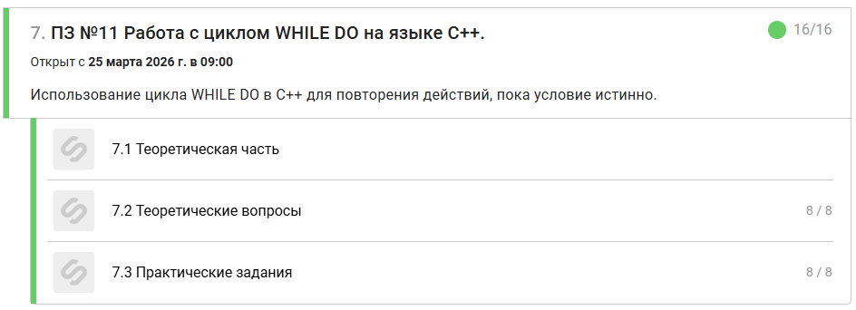

# Prakticheskoe_zadanie_11


-------------------------------------------------------------------------------------------------------------------------------------------------------------------------------------------------------------------------------------
## Задание 1
```
#include <iostream>

using namespace std;

int main() {
    setlocale(LC_ALL, "Russian");

    int n;
    cin >> n;
    int i = 1;

    while (i<= n) 
    {
        cout << i << " "; i++;
    }

    return 0;
}
```

-------------------------------------------------------------------------------------------------------------------------------------------------------------------------------------------------------------------------------------
## Задание 2
```
#include <iostream>

using namespace std;

int main()
{
    setlocale(LC_ALL, "Russian");

    int n;
    cin >> n;

    int i = 1;      
    int sum = 0;    

    while (i <= n)
    {
        sum = sum + i;  
        i++;            
    }

    cout << sum << endl;

    return 0;
}
```

-------------------------------------------------------------------------------------------------------------------------------------------------------------------------------------------------------------------------------------
## Задание 3
```
#include <iostream>

using namespace std;

int main() 
{
    setlocale(LC_ALL, "Russian");
    
    int num, sum = 0;
    cin >> num;
    while (num != 0) 
    {
        sum += num;
        cin >> num;
    }
    cout << sum;

    return 0;
}
```

-------------------------------------------------------------------------------------------------------------------------------------------------------------------------------------------------------------------------------------
## Задание 4
```
#include <iostream>

using namespace std;

int main()
{
    setlocale(LC_ALL, "Russian");

    int num, i = 1;
    cin >> num;

    while (i != num)
    {
        i++; 
        if (i % 2 == 0)
        {
            cout << i << " ";
        }
    }

    return 0;
}
```

-------------------------------------------------------------------------------------------------------------------------------------------------------------------------------------------------------------------------------------
## Задание 5
```
#include <iostream>

using namespace std;

int main() 
{
    setlocale(LC_ALL, "Russian");

    int n, f = 1, i = 1;;
    cin >> n;
    
    
    while (i <= n)
    {    
        f *= i; i++;
    }
    cout << f;

    return 0;
}
```

-------------------------------------------------------------------------------------------------------------------------------------------------------------------------------------------------------------------------------------
## Задание 6
```
#include <iostream>

using namespace std;

int main() 
{
    setlocale(LC_ALL, "Russian");

    int n;
    cin >> n;
    int i = 0;
    while (n != 0)
    {
        n/=10;
        i++;
    }
    cout << i;

    return 0;
}
```

-------------------------------------------------------------------------------------------------------------------------------------------------------------------------------------------------------------------------------------
## Задание 7
```
#include <iostream>
#include <cmath>

using namespace std;

int main() {
    setlocale(LC_ALL, "Russian");

    int N;
    cin >> N;

    
    if (N < 2) {
        cout << "Не простое" << endl;
        return 0;
    }

    bool isPrime = true;
    int i = 2;

    
    while (i <= sqrt(N)) {
        if (N % i == 0) {  
            isPrime = false;
            break;  
        }
        i++;
    }


    if (isPrime) {
        cout << "Простое" << endl;
    }
    else {
        cout << "Не простое" << endl;
    }

    return 0;
}
```

-------------------------------------------------------------------------------------------------------------------------------------------------------------------------------------------------------------------------------------
## Задание 8
```
#include <iostream>

using namespace std;

int main() {
    setlocale(LC_ALL, "Russian");
    
    int n;
    cin >> n;
    int i = 1;
    int y = 1;
    
    while (n >= i)
    {
        int x = 1;
        while (x <= n)
        {
            cout << (i * x) << " ";
            x++;
        }
        cout << endl;
        i++;
    }


    return 0;
}
```
-------------------------------------------------------------------------------------------------------------------------------------------------------------------------------------------------------------------------------------

